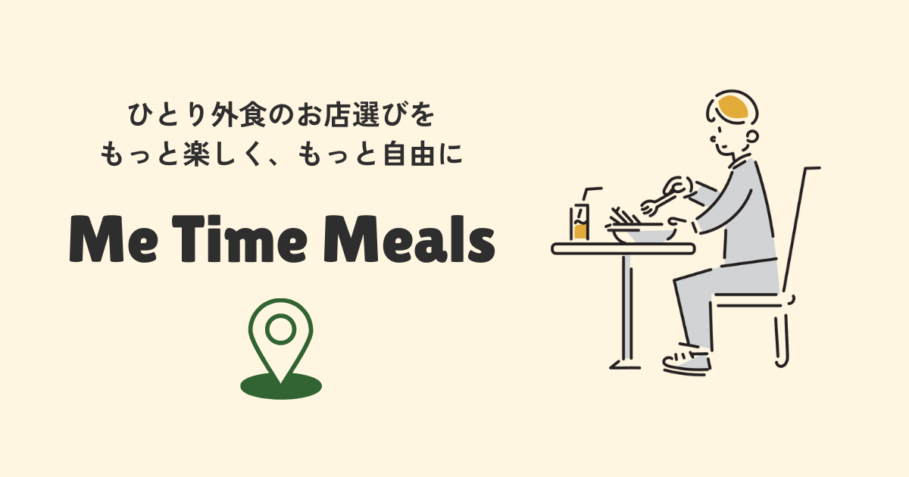

# **MeTime Meals**（ミータイムミールズ）

サービスURL：[Me Time Meals | ひとり外食投稿アプリ](https://www.metime-meals.com/)
## ■サービスの概要
「MeTime Meals（ミータイムミールズ）」は、「ひとり外食」に特化した飲食店投稿アプリです。一人だからこそ快適な空間で、周りを気にすることなく食事を楽しめる飲食店を探したいという方々が情報を共有することで、ソロ活の強い味方になります。地図上や個性的なタグからご自身のニーズにあったお店を探すことができます。
## ■このサービスへの思い・作りたい理由
前職が当直のシフト勤務であったため、友人と休みが合わず一人で外食する機会が多々ありました。その際、食べログなどのレビューサイトやGoogleマップのレビューを参考にしながらお店を探すのですが、一人で入店しても大丈夫なお店なのかを調べるのに苦労しました。そこで、同じように一人で外食している方の生の声を集めることで、ひとり外食のお店探しの一助になればいいと思いこのサービスの開発を決意しました。

## 機能一覧（🔑はログインが必要な機能）
|トップ画面 |カード一覧・検索機能|
|:--:|:--:|
|||
|アプリの使用場面とログイン後に使える機能を紹介しています|リストで投稿の一覧を確認でき、店名・場所・ジャンルのでの検索も可能です|

|地図一覧|地図検索・現在地取得|
|:--:|:--:|
|||
|地図上で投稿一覧を確認でき、ピンをタップするとモーダルが開きます|現在地を地図上に反映したり、店名・場所・ジャンルでの検索機能でお店を探せます|

|投稿詳細|投稿共有の動的OGP|
|:--:|:--:|
|||
|各投稿の詳細画面では表で情報をまとめています。|詳細ボタンから各投稿のシェアを行うとその投稿の写真が動的OGPとして表示されます|

|投稿作成🔑|ブックマーク機能🔑|
|:--:|:--:|
|||
|住所のオートコンプリート、直感的なレーティング、おすすめのタグによってひとり外食の投稿を作成可能です|気になるお店をサクサクブックマークして、マイページでまとめて確認できます|

## ■ 使用技術
| カテゴリー | 使用技術 |
:----|:----
| フロントエンド | Rails 7.1.3.4, TailwindCSS, DaisyUI  Javascript|
| バックエンド | Rails 7.1.3.4 (ruby 3.2.3)  |
| インフラ | heroku / AmazonS3 |
| DB | MySQL |
| 開発環境 | Docker |
| CI/CD |GitHub Actions|
| Web API | Google Maps API（Places API / Maps JavaScript API / Geolocation API）, Cloud Vision API|

## ■ 画面遷移図
[リンク](https://www.figma.com/design/MjY3Xjh4caHqLA78iD3zfW/metime_meals_画面遷移図?node-id=0-1)

## ■ ER図

詳細は[こちら](https://dbdiagram.io/d/metime_meals-66e3f2b56dde7f4149ffb45d)